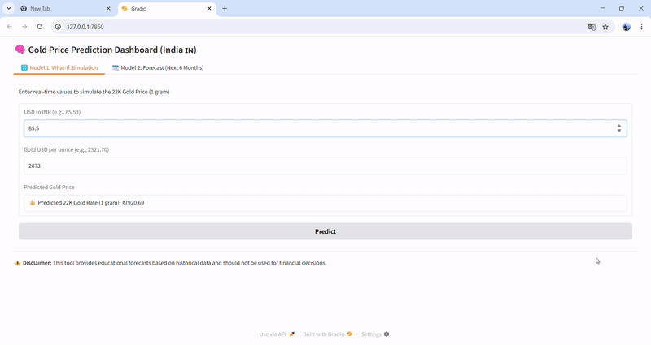

# 🧠 Gold Price Predictor (22K - INR/Gram)

This project uses machine learning models to predict the 22K gold price in INR based on the USD to INR rate and international gold price per ounce. It also includes a 1-year forecast using Facebook Prophet, and everything is presented in an interactive dashboard powered by Gradio.

---

## 🔍 Features

### 📊 Model 1 - What-If Simulation (Ridge Regression)
- Predicts the gold price per gram (22K) based on:
  - USD to INR rate
  - Gold price in USD per ounce
- Accepts manual user input
- **Includes user input logging with timestamp** (stored in `user_inputs_log.csv`)

### 🔮 Model 2 - Forecast (Prophet)
- 1-year forward-looking forecast for 22K gold prices
- Includes adjustment to match real market prices (e.g., ₹8770)
- Shows clear trends from **past 30 days to future 365 days**
- Bonus: Query gold price on a **specific date**

### 🎛️ Interactive Dashboard (Gradio)
- Tab 1: Predict gold price with live inputs
- Tab 2: Visualize forecast trends
- Tab 3: Select a future date to get predicted value

## 🖼️ Demo Preview

---

## 📁 Project Structure

gold-price-predictor/ ├── app.py # Gradio UI + Prediction Logic ├── ridge_model.pkl # Trained Ridge Regression model (Model 1) ├── scaler.pkl # Scaler used for Model 1 ├── gold_22k_usd_inr_data.csv # Historical gold + currency data ├── forecast_gold_22k.csv # Adjusted forecast from Prophet (Model 2) ├── user_inputs_log.csv # ✅ Logged user predictions with timestamp ├── requirements.txt # Python dependencies └── README.md # You're here
