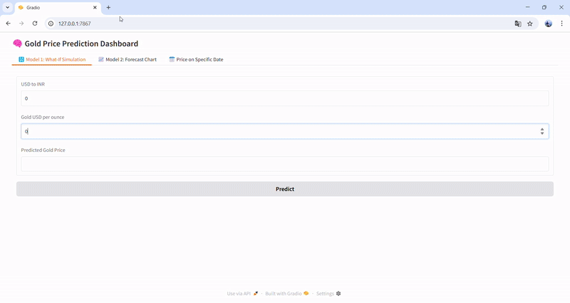

# Gold Price Predictor (22K - INR/Gram)

This project uses machine learning models to predict the 22K gold price in INR based on the USD to INR rate and international gold price per ounce. 
It also includes a 6-month forecast using Facebook Prophet, all displayed in an interactive dashboard powered by Gradio.
---

## Features

-  **Model 1 - What-If Simulation**: 
  Predict gold rate using user inputs for USD to INR and gold price per ounce using a trained Ridge Regression model.

-  **Model 2 - Forecast**: 
  View 6-month future predictions of gold prices using Prophet time series forecasting.

- Simple and interactive dashboard built with **Gradio**.
- 
## Project Structure

gold-price-predictor/ │ ├── app.py # Gradio app UI + ML logic ├── ridge_model.pkl # Trained Ridge Regression model (Model 1) ├── scaler.pkl # Scaler used during training ├── forecast_gold_22k.csv # Forecast output (Model 2 - Prophet) ├── gold_22k_usd_inr_data.csv # Original dataset used for training ├── requirements.txt # Python dependencies ├── README.md # This file
